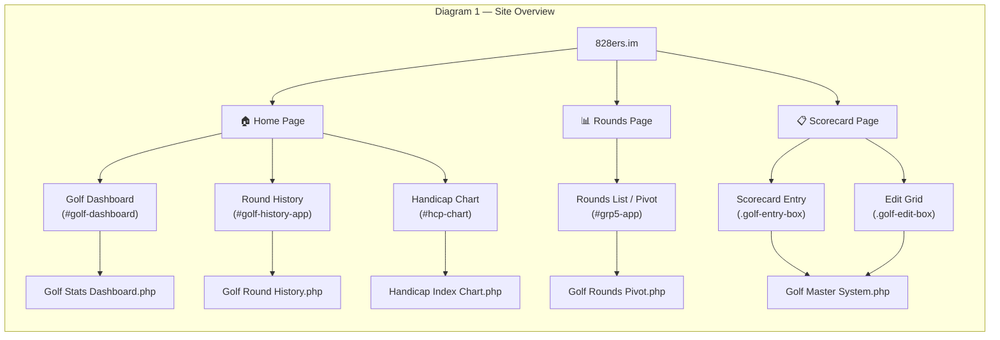

```mermaid
flowchart TD

    %% ==========================================
    %% DIAGRAM 1: SITE OVERVIEW
    %% ==========================================
    subgraph D1 ["Diagram 1 — Site Overview"]
        direction TB
        D1_Site["828ers.im"] --> D1_Home["🏠 Home Page"]
        D1_Site --> D1_Scorecard["📋 Scorecard Page"]
        D1_Site --> D1_Rounds["📊 Rounds Page"]
        
        %% Home Page Elements
        D1_Home --> D1_SC1["Golf Dashboard\n(#golf-dashboard)"]
        D1_Home --> D1_SC2["Round History\n(#golf-history-app)"]
        D1_Home --> D1_SC3["Handicap Chart\n(#hcp-chart)"]
        
        %% Scorecard Page Elements
        D1_Scorecard --> D1_SC5["Scorecard Entry\n(.golf-entry-box)"]
        D1_Scorecard --> D1_SC6["Edit Grid\n(.golf-edit-box)"]
        
        %% Rounds Page Elements
        D1_Rounds --> D1_SC4["Rounds List / Pivot\n(#grp5-app)"]
        
        %% File Mapping
        D1_SC1 --> D1_F1["Golf Stats Dashboard.php"]
        D1_SC2 --> D1_F2["Golf Round History.php"]
        D1_SC3 --> D1_F3["Handicap Index Chart.php"]
        D1_SC4 --> D1_F4["Golf Rounds Pivot.php"]
        D1_SC5 --> D1_F5["Golf Master System.php"]
        D1_SC6 --> D1_F5
    end
```
