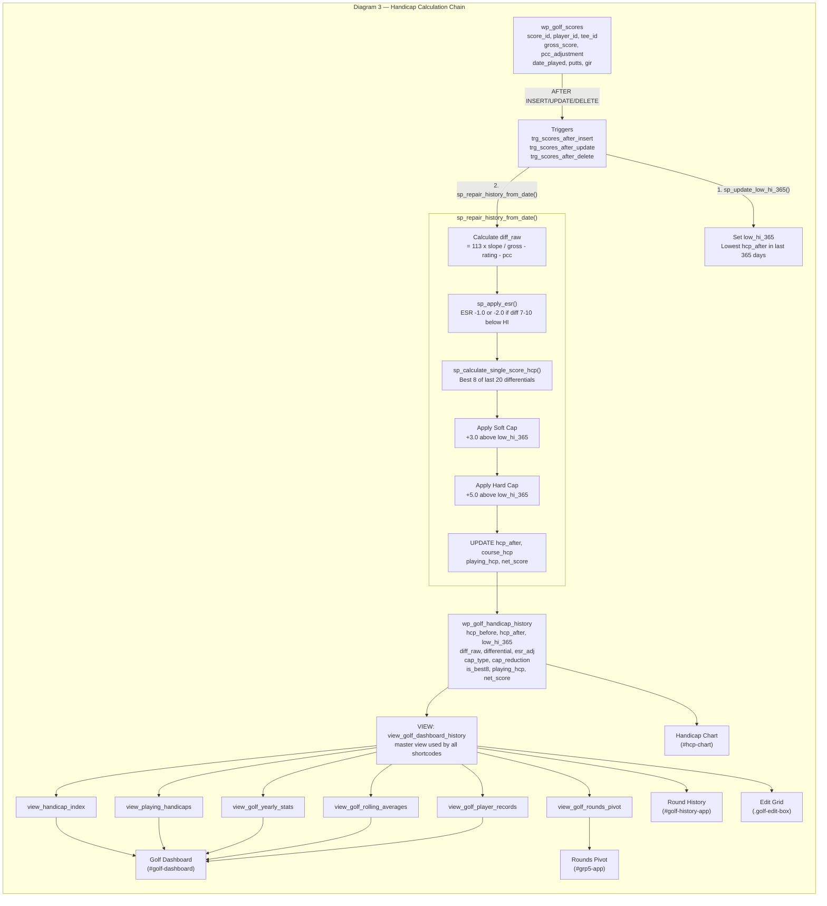

```mermaid
flowchart TD

%% ==========================================
    %% DIAGRAM 3: HANDICAP CALCULATION CHAIN
    %% ==========================================
    subgraph D3 ["Diagram 3 — Handicap Calculation Chain"]
        direction TB
        D3_SCORE["wp_golf_scores\nscore_id, player_id, tee_id\ngross_score, pcc_adjustment\ndate_played, putts, gir"] 
        D3_SCORE -->|AFTER INSERT/UPDATE/DELETE| D3_TRG["Triggers\ntrg_scores_after_insert\ntrg_scores_after_update\ntrg_scores_after_delete"]
        
        D3_TRG -->|"1. sp_update_low_hi_365()"| D3_LOWHI["Set low_hi_365\nLowest hcp_after in last 365 days"]
        D3_TRG -->|"2. sp_repair_history_from_date()"| D3_R1
        
        subgraph D3_REPAIR ["sp_repair_history_from_date()"]
            direction TB
            D3_R1["Calculate diff_raw\n= 113 x slope / gross - rating - pcc"] --> D3_R2["sp_apply_esr()\nESR -1.0 or -2.0 if diff 7-10 below HI"]
            D3_R2 --> D3_R3["sp_calculate_single_score_hcp()\nBest 8 of last 20 differentials"]
            D3_R3 --> D3_R4["Apply Soft Cap\n+3.0 above low_hi_365"]
            D3_R4 --> D3_R5["Apply Hard Cap\n+5.0 above low_hi_365"]
            D3_R5 --> D3_R6["UPDATE hcp_after, course_hcp\nplaying_hcp, net_score"]
        end
        
        D3_R6 --> D3_HH["wp_golf_handicap_history\nhcp_before, hcp_after, low_hi_365\ndiff_raw, differential, esr_adj\ncap_type, cap_reduction\nis_best8, playing_hcp, net_score"]
        
        D3_HH --> D3_VDH["VIEW: view_golf_dashboard_history\nmaster view used by all shortcodes"]
        D3_VDH --> D3_V1["view_handicap_index"]
        D3_VDH --> D3_V2["view_playing_handicaps"]
        D3_VDH --> D3_V3["view_golf_yearly_stats"]
        D3_VDH --> D3_V4["view_golf_rolling_averages"]
        D3_VDH --> D3_V5["view_golf_player_records"]
        D3_VDH --> D3_V6["view_golf_rounds_pivot"]
        
        D3_V1 & D3_V2 & D3_V3 & D3_V4 & D3_V5 --> D3_DASH["Golf Dashboard\n(#golf-dashboard)"]
        D3_VDH --> D3_HIST["Round History\n(#golf-history-app)"]
        D3_VDH --> D3_EDIT["Edit Grid\n(.golf-edit-box)"]
        D3_V6 --> D3_PIVOT["Rounds Pivot\n(#grp5-app)"]
        D3_HH --> D3_CHART["Handicap Chart\n(#hcp-chart)"]
    end
```
    