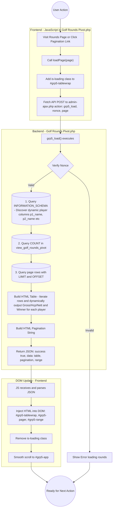

```mermaid
flowchart TD
    Start((User Action)) --> Visit["Visit Rounds Page or Click Pagination Link"]

    subgraph Frontend ["Frontend - JavaScript in Golf Rounds Pivot.php"]
        direction TB
        Visit --> JS_Load["Call loadPage(page)"]
        JS_Load --> JS_Loading["Add is-loading class to #grp5-tablewrap"]
        JS_Loading --> JS_Fetch["Fetch API POST to admin-ajax.php action: grp5_load, nonce, page"]
    end

    subgraph Backend ["Backend - Golf Rounds Pivot.php"]
        direction TB
        JS_Fetch --> PHP_Init["grp5_load() executes"]
        PHP_Init --> PHP_Nonce{"Verify Nonce"}
        PHP_Nonce -- Valid --> DB_Schema[("1. Query INFORMATION_SCHEMA - Discover dynamic player columns p1_name, p2_name etc")]
        DB_Schema --> DB_Count[("2. Query COUNT in view_golf_rounds_pivot")]
        DB_Count --> DB_Rows[("3. Query page rows with LIMIT and OFFSET")]
        DB_Rows --> PHP_BuildTable["Build HTML Table - Iterate rows and dynamically output Gross/Hcp/Nett and Winner for each player"]
        PHP_BuildTable --> PHP_BuildPager["Build HTML Pagination String"]
        PHP_BuildPager --> PHP_JSON["Return JSON: success true, data: table, pagination, range"]
    end

    subgraph DOM_Update ["DOM Update - Frontend"]
        direction TB
        PHP_JSON --> JS_Receive["JS receives and parses JSON"]
        JS_Receive --> DOM_Inject["Inject HTML into DOM: #grp5-tablewrap, #grp5-pager, #grp5-range"]
        DOM_Inject --> JS_Done["Remove is-loading class"]
        JS_Done --> JS_Scroll["Smooth scroll to #grp5-app"]
    end

    PHP_Nonce -- Invalid --> JS_Error["Show Error loading rounds"]

    JS_Scroll --> End((Ready for Next Action))
    JS_Error --> End
```
