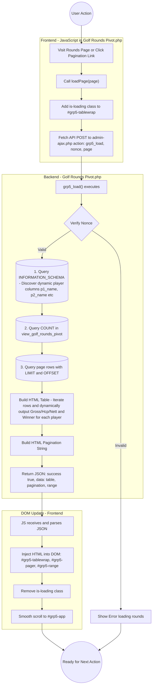

## England Golf overnight feed

### Purpose

The overnight feed replaces the England Golf-controlled parts of a manually
entered round once the completed round becomes available from England Golf. If
no manual round exists, it creates a complete new round.

The existing `wp_golf_scores.score_id` must never be replaced. Manually entered
putts, greens in regulation (`gir`), and exclusion status must also be
preserved.

### England Golf field destinations

| England Golf value | England Golf source | Database destination |
|---|---|---|
| Player | Configured England Golf player | `wp_golf_scores.player_id` |
| Date played | `PlayDate` | `wp_golf_scores.date_played` |
| Course or facility | `FacilityId` or `ClubId`, with `FacilityName` or `CourseName` | Used to find `wp_golf_courses.course_id` |
| Tee colour | `Marker` | Used to find `wp_golf_tees.tee_id` |
| Gross score | `AdjustedGross`, then the existing supported score alternatives | `wp_golf_scores.gross_score` |
| PCC | `Pcc`, `PCC`, `pcc`, or `Adjustments` | `wp_golf_scores.pcc_adjustment` |
| Course rating | `CourseRating` | `wp_golf_scores.round_course_rating` and `wp_golf_tees.course_rating` |
| Slope rating | `Slope` | `wp_golf_scores.round_slope_rating` and `wp_golf_tees.slope_rating` |
| Par | `Par`, then `CoursePar`, then scorecard `TotalPar` | `wp_golf_scores.round_par` and `wp_golf_tees.par` |
| Rating source | Set by the feed | `wp_golf_scores.rating_source` as `eg_import` |
| Rating update time | Set when the feed writes the round | `wp_golf_scores.rating_updated_at` |
| Hole scores and hole pars | Detailed England Golf scorecard | Existing golf hole and hole-score tables |

`CoursePar` is the total par supplied in the main England Golf round record.
`TotalPar` is the total supplied by the separately requested detailed
scorecard. `TotalPar` is only a fallback when neither `Par` nor `CoursePar` is
available.

The England Golf `ScoreId` and `ScoreCode` are only used to request the detailed
scorecard. They are not stored in `wp_golf_scores` and must not replace the
database `score_id`.

### Validation and error reporting

Course rating, slope rating, and par must be present and numeric before the feed
changes either table. For the supported 18-hole rounds, course rating must be
between 40.0 and 100.0, slope rating must be between 55 and 155, and par must be
between 54 and 90. Where all 18 hole pars are available, their total must agree
with the selected round par.

The feed must not guess a missing par or use 72 as a fallback. If required
information is absent, invalid, or inconsistent, it must:

1. Leave `wp_golf_scores` and `wp_golf_tees` unchanged.
2. Write the player, date, course, tee, and failed field to the server log.
3. Include the same problem in the existing overnight discrepancy email.

### Matching an existing manual round

An existing round is safe to overwrite only when player ID, date, course, and
tee colour all match England Golf.

The database `score_id` identifies the existing database row and remains
unchanged. If the player and date match but the course or tee colour differs,
the feed must report the discrepancy and must not insert a second round
automatically.

### Existing-round overwrite

For a confirmed match, the feed overwrites only:

- `tee_id`
- `gross_score`
- `pcc_adjustment`
- `round_course_rating`
- `round_slope_rating`
- `round_par`
- `rating_source`
- `rating_updated_at`

It preserves:

- `score_id`
- `putts`
- `gir`
- `is_excluded`
- any other field not controlled by England Golf

### New-round insertion

The feed inserts a new round only when no existing round matches the player and
date. The insert must include the complete England Golf field set, including
course rating, slope rating, par, rating source, and rating update time. These
fields must not be left null.

### Delayed England Golf records

Each overnight run checks yesterday and also rechecks manual rounds from the
previous seven days whose source is still `manual_placeholder`. This allows a
manual round to be overwritten if England Golf publishes it later than the
first overnight check.

### Tee correction

The correct tee is found by course or facility and tee colour together. Tee
colour alone is not sufficient because different courses can each have a tee
called White, Yellow, or another shared colour.

When England Golf omits its facility ID, course names are compared after
removing punctuation and an optional trailing `Golf Club` or `Golf Course`.
This allows a safe match such as `Ramsey` to `Ramsey Golf Club` without using
partial-name matching.

After finding the correct tee, the feed compares its course rating, slope
rating, and par with England Golf. When they differ, `wp_golf_tees` is updated
from England Golf. The old and new values are written to the server log.

The tee correction and score overwrite or insertion must succeed together. If
either database operation fails, neither change is retained.

### Manual preview

A `--preview` command-line option is required for checking the live England
Golf response before enabling feed changes. It is run manually on the server
that contains `config.py` and the England Golf credentials.

Preview mode:

1. Logs in to England Golf.
2. Fetches the same rounds and detailed scorecards as the overnight feed.
3. Displays the received course rating, slope rating, and par.
4. Reports the score and tee changes that would be made.
5. Performs no database inserts or updates.

The existing `--test` option is not preview mode because it changes the date
being checked and can still write to the database.

### Code areas requiring amendment

| File and function | Required change |
|---|---|
| `scripts/eg_utils.py:parse_eg_round_ratings` | Returns validated course rating, slope rating, and par from the documented England Golf sources without a guessed default. |
| `scripts/golf_checker.py:resolve_tee` | Matches course or facility and tee colour and does not use a whole-database tee-colour match. |
| `scripts/golf_checker.py:ensure_course_and_tee` | Compares existing tee values with England Golf and updates changed values. |
| `scripts/golf_checker.py:insert_score` | Accepts the validated England Golf ratings directly; overwrites a confirmed manual match or inserts a complete new row while preserving manual-only fields. |
| `scripts/golf_checker.py:process_eg_round` | Keeps the tee and score changes in one database transaction. |
| `scripts/golf_checker.py:run_daily_check` | Reads and validates ratings before database work, rechecks recent unresolved manual rounds, enforces the full matching rules, and adds failures to logs and discrepancy emails. |
| `scripts/golf_checker.py` command-line handling | Provides the non-writing `--preview` option. |
| `scripts/test_golf_checker_tee_resolution.py` | Covers rating parsing, course-and-colour tee selection, manual overwrite, complete insertion, preserved fields, mismatch rejection, preview safety, and rollback. |

### Completion checks

The feed amendment is complete only when automated tests prove that:

1. An existing manual round keeps its `score_id`, putts, GIR, and exclusion
   status while EG-controlled fields are overwritten.
2. A missing round is inserted once with non-null course rating, slope rating,
   and par.
3. A changed England Golf rating updates both the round snapshot and the
   correct tee.
4. Two courses with the same tee colour cannot be confused.
5. Missing or inconsistent England Golf data changes neither table and appears
   in the discrepancy report.
6. A database failure leaves both the tee and score unchanged.
7. Running the same feed information again creates no duplicate.
8. Preview mode reports intended changes and leaves the database unchanged.
